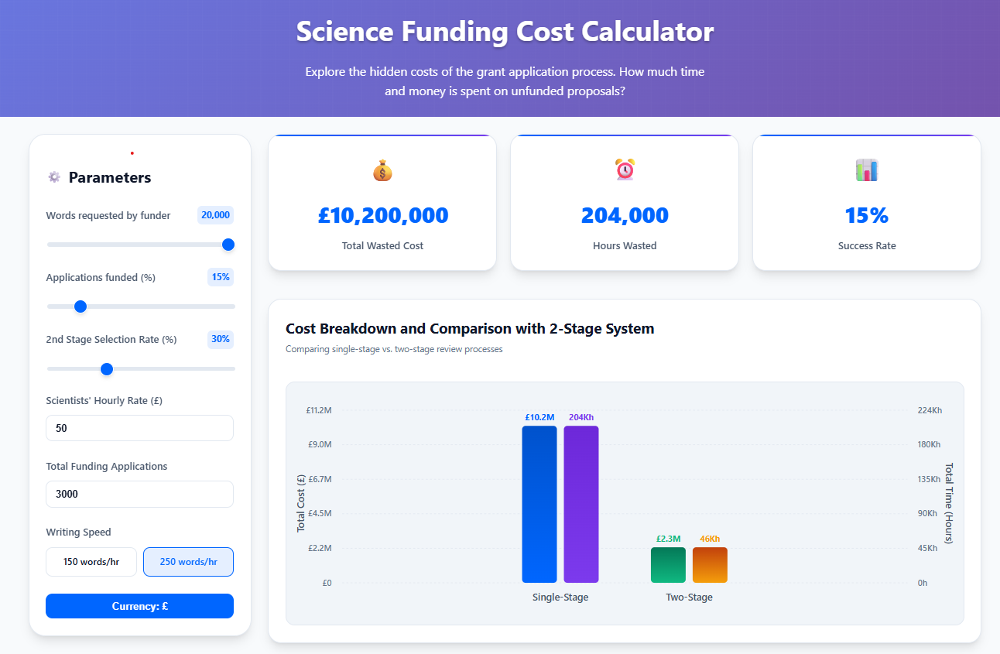

# Grant Review Cost Visualizer

## Usage

**▶️ [Live demo](https://dbann.github.io/grantreview/)**

**Motivation:**
Is the current academic funding system optimal? The process of preparing, reviewing, and managing grant applications requires significant resources, yet only a small percentage of projects receive funding. How much time and money are wasted on unsuccessful applications? Could the process be more efficient, reducing the cost to both researchers and funders?

This tool allows you to explore these questions by visualizing the hidden costs in the grant application process—including, **new in this version, a direct comparison between a traditional single‑stage review and a two‑stage approach (outline proposals followed by invited full submissions).**

## Key Questions

* **How much time and money are lost on unsuccessful applications?**
* **Is the current funding process truly optimal?**
* **Would a two‑stage review (outline → full) save resources compared with a one‑stage review?**
* **How can we make scientific funding more efficient?**

By adjusting parameters such as funding rate, words required at each stage, hourly rate, and total applications, this tool reveals the true cost of different funding models, highlights inefficiencies, and encourages discussion on possible improvements.

## Features

* **Adjustable Parameters:** Simulate diverse grant scenarios by modifying words required, funding rate, hourly rate, total applications, and (in two‑stage mode) the proportion of outline proposals invited to submit full applications.
* **Two‑Stage Review Comparison:** Instantly compare the cost and time implications of a single‑stage versus outline‑plus‑full submission process.
* **Real‑Time Visual Feedback:** Interactive charts show total cost and researcher hours consumed for both successful and unsuccessful applications, broken down by review stage.
* **Clear Savings Metrics:** Automatic calculation of absolute and percentage savings (or extra costs) when switching between review models.
* **Simple Interface:** Drag sliders or type values to experiment and see immediate results.

## Tags

`#ScienceFunding #GrantApplications #ResearchEfficiency #FundingSystem #TimeWaste #ResearchWaste #OpenScience #AcademicFunding #GrantReview #FundingOptimization #Epidemiology #ResearchCommunity #TwoStageReview`

## Contact

For feedback or inquiries, please contact: [david.bann@ucl.ac.uk](mailto:david.bann@ucl.ac.uk)
