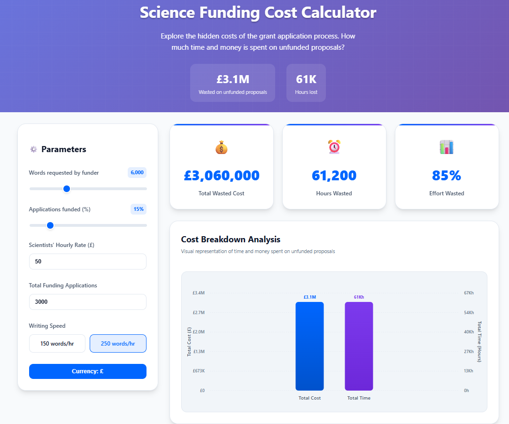

# Grant Review Cost Visualizer

## Usage
Visit the hosted page: [Grant Review Cost Visualizer](https://dbann.github.io/grantreview/)

**Motivation:**  
Is the current academic funding system optimal? The process of preparing, reviewing, and managing grant applications requires significant resources, yet only a small percentage of projects receive funding. How much time and money is wasted on unsuccessful applications? Could the process be more efficient, reducing the cost to both researchers and funders?

This tool allows you to explore these questions by visualizing the hidden costs in the grant application process, prompting reflection on how the system might be improved.

## Key Questions:
- **How much time and money are lost on unsuccessful applications?**
- **Is the current funding process truly optimal?**
- **Can we make scientific funding more efficient?**

By adjusting parameters like funding rate, words required, hourly rate, and total applications, this tool shows the true cost of the current funding system, highlighting inefficiencies and encouraging discussion on possible improvements.

## Features
- **Adjustable Parameters**: Simulate different grant scenarios by modifying words required, funding rate, hourly rate, and total applications.
- **Real-Time Visual Feedback**: Interactive charts showing total cost and time spent on unsuccessful applications.
- **Simple Interface**: Easily experiment with different input values and see immediate results.

## Tags
`#ScienceFunding #GrantApplications #ResearchEfficiency #FundingSystem #TimeWaste #ResearchWaste #OpenScience #AcademicFunding #GrantReview #FundingOptimization #Epidemiology #ResearchCommunity`

## Contact
For feedback or inquiries, please contact: [david.bann@ucl.ac.uk](mailto:david.bann@ucl.ac.uk)
